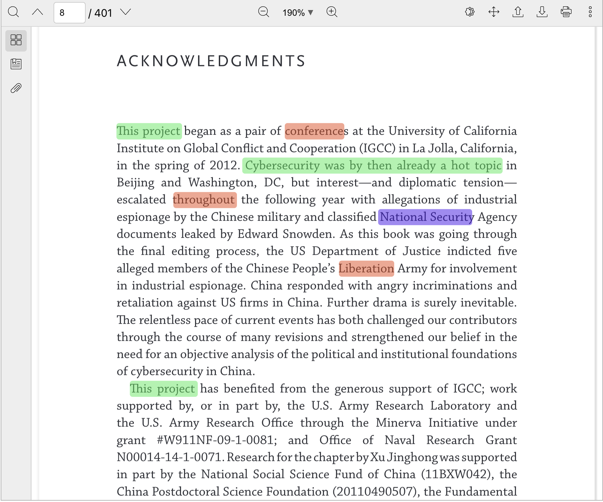

In this code I am testing the react-pdf-highlighter library.

## Install

* Install the dependencies

- for frontend
```console
$ npm install
```
- for backend
```console
$ cd server & npm install
```

* Run locally


- for backend
```console
$ cd server & node server.js
```
- for frontend
```console
$ npm start
```

Visit http://localhost:3000 to see it in action.

## Todo
- [x] highlighting by phrase.
- [x] add possibility of selecting text, then store it as new phrase with it's description
- [x] multiple line highlights (every line is a span)
- [x] dynamicaly chose pdf file
- [x] design db
- [ ] create & consume api
    - [x] create phrase
    - [x] update phrase
    - [ ] delete phrase


## Spotlights

[App.js](src/App.js):

``` javascript
import { Viewer, Worker } from '@react-pdf-viewer/core';
import { defaultLayoutPlugin } from '@react-pdf-viewer/default-layout';
import { searchPlugin } from '@react-pdf-viewer/search';

import '@react-pdf-viewer/search/lib/styles/index.css';
import '@react-pdf-viewer/core/lib/styles/index.css';
import '@react-pdf-viewer/default-layout/lib/styles/index.css';

const data = ['should', 'States', 'Group', 'Opening', 'pdf', 'example', 'File', 'includes']

// defining renderHighlights

const defaultLayoutPluginInstance = defaultLayoutPlugin();
const searchPluginInstance = searchPlugin({
        keyword: [
            ...data.map(text => new RegExp(text)) 
        ],
        renderHighlights,
})

return (
    <Worker workerUrl="https://unpkg.com/pdfjs-dist@2.15.349/build/pdf.worker.js">
        <div style={{ height: '750px' }}>
            <Viewer
                fileUrl={`${process.env.PUBLIC_URL}/pdf-open-parameters.pdf`}
                plugins={[
                    defaultLayoutPluginInstance,
                    searchPluginInstance,
                ]}
            />
        </div>
    </Worker>
);
```

<!--  -->

